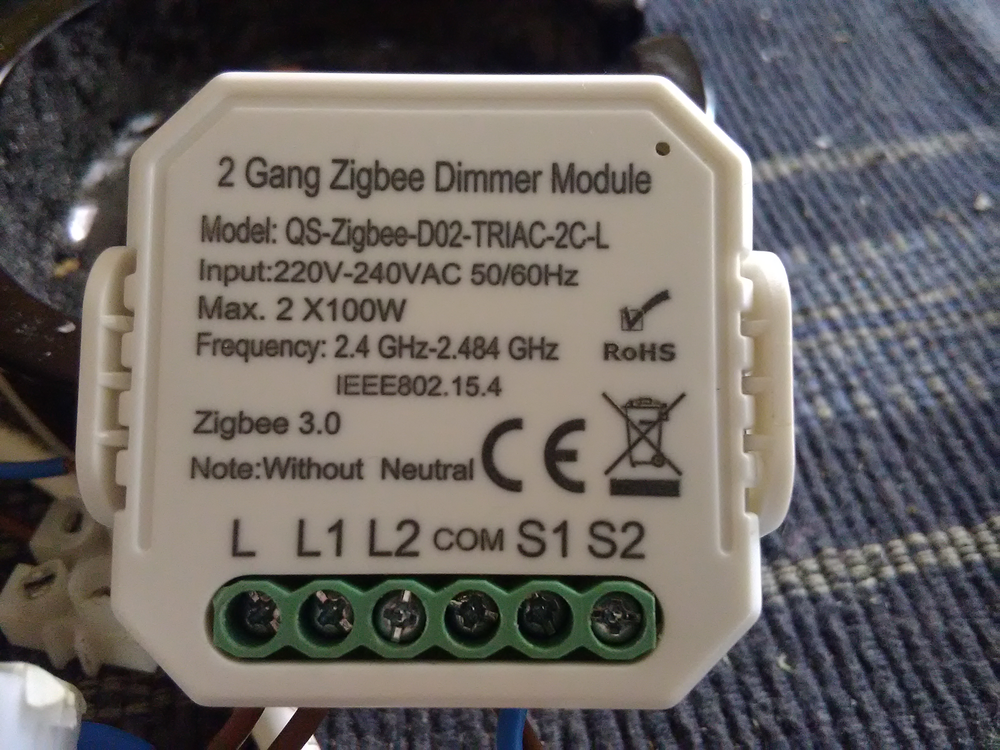
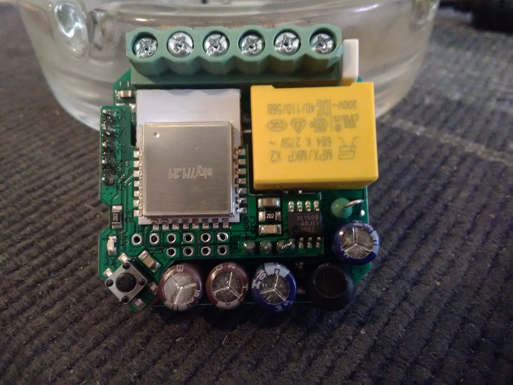

# tuya Switches Dimmer

| Type | Model | Gang | Neutrale | Tested in ZHA |
|-|-|-|-|-|
| Dimmer | QS-Zigbee-D02-TRIAC-L | 1 | No | ⬜ |
| Dimmer | QS-Zigbee-D02-TRIAC-LN | 1 | Yes | ⬜ |
| Dimmer | QS-Zigbee-D02-TRIAC-2C-L | 2 | No | ✅ |
| Dimmer | QS-Zigbee-D02-TRIAC-2C-LN | 2 | Yes | ⬜ |
| Switsh | QS-Zigbee-S05-L | 1 | No | ⬜ |
| Switsh | QS-Zigbee-S05-LN | 1 | Yes | ⬜ |
| Switsh | QS-Zigbee-S04-C2-L | 2 | No | ⬜ |
| Switsh | QS-Zigbee-S04-C2-LN | 2 | Yes | ⬜ |
| Curtain | QS-Zigbee-C01 | NA | Yes | ⬜ |

✅ = Working OK ⬜ = Not tested but is very likely woking OK then its very ZB3 devices and no tuya clusters.

The dimmers is needeing reset switches and the switches needing rocker switches for working OK.  

First out is dula dimmer without neutrale lal QS-Zigbee-D02-TRIAC-2C-L




ZH Device info:
```
TS110F
by _TZ3000_92chsky7
Silicon Labs EZSP
Zigbee info
IEEE: 60:a4:23:ff:fe:80:11:a0
Nwk: 0x5454
Device Type: Router
LQI: 164
RSSI: -59
Last Seen: 2021-07-04T20:39:08
Power Source: Mains
```

<details>
  <summary>Zigbee Device Signature:</summary>

```
2021-07-04 21:50:27 DEBUG (MainThread) [zigpy.zcl] [0x5454:1:0x0019] OTA query_next_image handler for '_TZ3000_92chsky7 TS110F': field_control=0, manufacture_id=4098, image_type=5634, current_file_version=66, hardware_version=None

{
  "node_descriptor": "NodeDescriptor(logical_type=<LogicalType.Router: 1>, 
complex_descriptor_available=0, 
user_descriptor_available=0, 
reserved=0, 
aps_flags=0, 
frequency_band=<FrequencyBand.Freq2400MHz: 8>, 
mac_capability_flags=<MACCapabilityFlags.AllocateAddress|RxOnWhenIdle|MainsPowered|FullFunctionDevice: 142>, manufacturer_code=4098, 
maximum_buffer_size=82, 
maximum_incoming_transfer_size=82, 
server_mask=11264, 
maximum_outgoing_transfer_size=82, 
descriptor_capability_field=<DescriptorCapability.0: 0>, 
*allocate_address=True, 
*is_alternate_pan_coordinator=False, 
*is_coordinator=False, 
*is_end_device=False, 
*is_full_function_device=True, 
*is_mains_powered=True, 
*is_receiver_on_when_idle=True, 
*is_router=True, 
*is_security_capable=False)",
  "endpoints": {
    "1": {
      "profile_id": 260,
      "device_type": "0x0101",
      "in_clusters": [
        "0x0000",
        "0x0004",
        "0x0005",
        "0x0006",
        "0x0008"
      ],
      "out_clusters": [
        "0x000a",
        "0x0019"
      ]
    },
    "2": {
      "profile_id": 260,
      "device_type": "0x0101",
      "in_clusters": [
        "0x0004",
        "0x0005",
        "0x0006",
        "0x0008"
      ],
      "out_clusters": []
    }
  },
  "manufacturer": "_TZ3000_92chsky7",
  "model": "TS110F",
  "class": "zigpy.device.Device"
}
```
  </details>
  
Its working out of the box with ZHA and dont have any porblems with auto power of or somthing.  
Its onlay have incluster so its not sending commands to other device as one remote only like one light with on local override (that can being overridden with commands recived).  
On/Off and Light level is reported to ZHA nicely then changed localy or from ZHA :-))  
Also its one real router and is extending the mesh nicely but the atenna is OK but its little limeted of the metal things around it but not very bad as "other" chenese normaly is having (Home).  
### Inside:
The without neutal need is getting current from the ground that is conected thrue the loade. So if the load is diconected the device is dead !!  
The device is easely opended from behind and is poping up with little force between the top and button from one side and working around.

Its one tuya Zigbe module iside but i cant finding it then its have other pinot then ll in the devs docks but its very likely on MG21 then the more simple switch have on minipins module with MG21 and i think thwy is not doing on new that is less capable.  
So very likely is one more compact version of the tuya ZS3L and is having 2 X 7 plus 8 pads plus SWD for flashing and debug conection (not mounted).  
On the PCB the module is mounted have more ciricuts on the underside but its not possible looking on if not unsoulding the 5 plus 3 pins to the main PCB.  
The DIL 8 is one power converter for making the 3.3 V the module is needing.


The large IC is one Triac (of 2) and then its one optocopler under it (slam 4 pins) and 4 large power diodes to the L2.  
Very likely is one more Triac on the other side of the PCB and one optocopler for the L1 branche.  
The 5 pin rowe is from up to down: S1, S1, ?, ? (very likely the output to triacl 1 and 2) and GND.  
The 3 pin row is very likely power in the middle and ground in one sede but i cant see it for 100%.  
   
Then getting the OK pinout of the Zigbee module i like trying dumping it and look if tuya have start protecting there devices or not.
  
Next up [mounting one dubble dimmer in one EU wall box with Simens Delta line frame](/DELTA%20_Line/README.md) like this:


